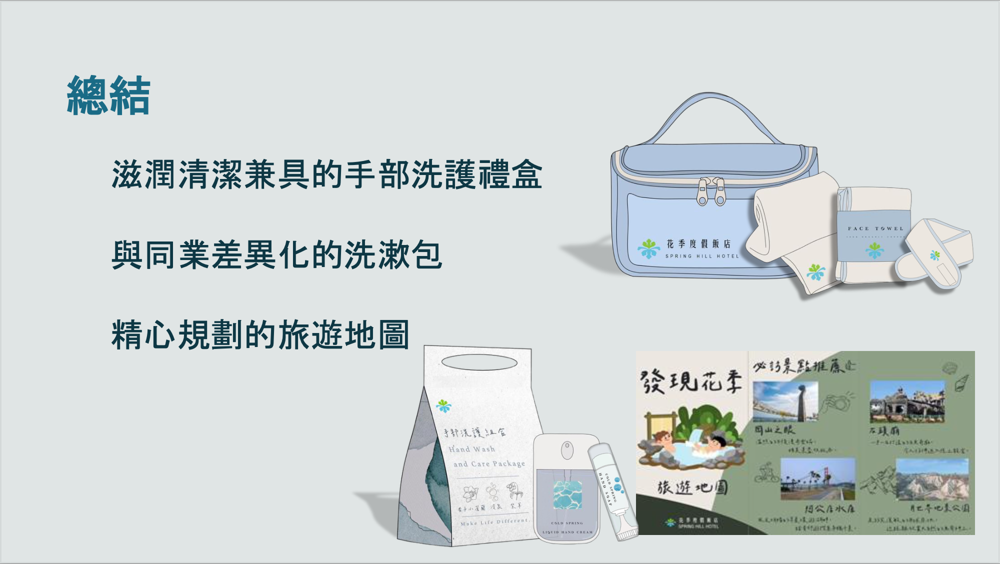
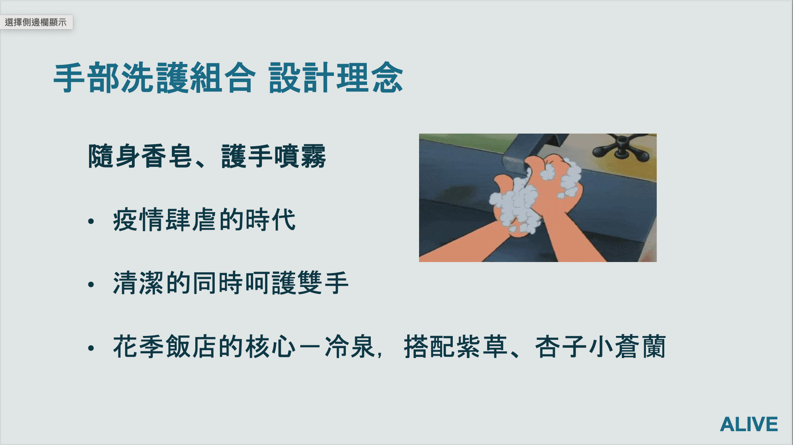
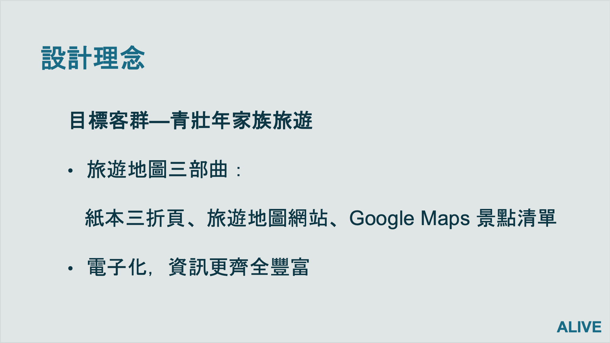

# Business Proposal Competition — Spring Hill Resort

## 📌 Problem
The resort lacked differentiated products and integrated travel experiences to enhance customer engagement and extend visitor stay duration.

---

## 💡 Solution
Developed an integrated business proposal combining product design, service experience, and digital travel planning to enhance the overall customer journey.

Key components:
- Designed branded product offerings to enhance customer experience and create additional revenue streams  
- Developed differentiated service kits tailored to hotel guests  
- Built an integrated travel experience through digital and physical touchpoints  

---

## 🔍 Highlights

### Product Design
- Developed a hand-care product line inspired by the resort’s hot spring identity  
- Integrated hygiene and wellness concepts to align with post-pandemic consumer needs  

### Service Experience
- Designed a customized overnight toiletry kit to improve usability and differentiation  
- Focused on convenience, hygiene, and sustainability  

### Travel Experience Design
- Created a three-layer travel guide system:
  - Printed brochure  
  - Interactive website  
  - Google Maps travel list  

- Enhanced user experience by providing up-to-date, location-based travel information  

---

## 📈 Impact
- Strengthened brand differentiation through integrated product and service design  
- Improved customer experience across pre-trip, on-site, and post-trip stages  
- Enabled scalable digital travel planning tools for customer engagement  

---

## 🌐 Project Outputs

- Interactive travel website:  
  https://sites.google.com/view/springhill-alive  

- Google Maps travel list:  
  https://maps.app.goo.gl/tpiUUWwpYqbDgWZp9?g_st=i  

---

## 📊 Sample Proposal Output

### Integrated Product & Experience Design

This slide summarizes the overall proposal, integrating three key components:  
1. Hand-care product line inspired by the resort’s hot spring identity
2. Differentiated overnight toiletry kit
3. Curated travel experience design

The goal is to create a cohesive customer journey that extends beyond accommodation, combining product, service, and local exploration.

---

### Product Design — Hand Care Set

This component focuses on product innovation aligned with post-pandemic hygiene awareness.  
The hand-care set combines portability and usability, while incorporating the resort’s signature hot spring concept through ingredients and visual design.  

The product aims to enhance both functional value (cleaning and protection) and brand identity.

---

### Travel Experience — Digital Map

This slide presents a three-layer travel experience design:  
a printed brochure, a website, and a Google Maps destination list.  

The system provides structured, up-to-date travel information, helping guests plan their trips more efficiently and increasing engagement beyond the hotel stay.  

---

## 🛠 Tools
- Business Strategy & Proposal Design  
- Customer Experience (CX) Design  
- Product Concept Development  
- Market Positioning  

---

## ⚠️ Disclaimer
This project was developed as part of a business proposal competition.  
All concepts are for demonstration purposes only and do not represent actual business implementation.
